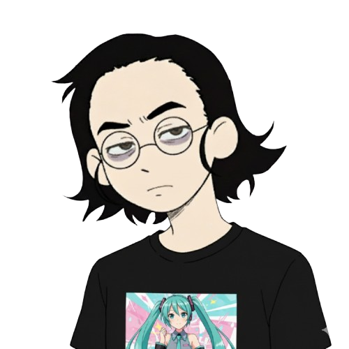

 <div>
  
</div>

<!--Nome e função-->
#  ɪ'ᴍ ᴍᴀʀᴄᴇʟᴏ ᴄᴀʀɴᴇɪʀᴏ! 
*Desenvolvedor Web & Mobile | Estudante de ADS | Estagiário na SEFIN*  
<br /> 

<!--Introdução-->               
<p align="left">Sou desenvolvedor web e mobile, com paixão por automação, criação de aplicações interativas e exploração de novas tecnologias. Tenho experiência com Ruby on Rails, JavaScript, HTML, CSS, Bootstrap, e gosto de desenvolver projetos que tornam processos mais fáceis e dinâmicos.</p>

- ✨ Aprendiz para toda a vida  
- 🌱 Atualmente explorando desenvolvimento web avançado e automação  
- 💁‍♂️ Estagiário na [SEFIN - Secretaria de Finanças, Fortaleza](https://www.fortaleza.ce.gov.br/sefin)  
- 🏙 Apaixonado por criar jogos e aplicações interativas  
- ✍ Escrevo conteúdos técnicos e tutoriais  
- ❤ Contribuindo para projetos pessoais e open-source  
- 💻 Confira meu [GitHub](https://github.com/Marcelo-C-Silva) para mais detalhes

 [;I'm+26+years+old+ദ്ദി(⎚_⎚);I'm+from+Brazil+ദ്ദി(⎚_⎚);I+Graduated+systems+Development+ദ്ദി(⎚_⎚);Be+Welcome!+ദ്ദി(⎚_⎚))](https://git.io/typing-svg)
</div>
<table>
  <tr>
   <td align="left" valign="top">
      <h3>Interesses</h3>
      <ul>
        <li>Desenvolvimento Web e Mobile</li>
        <li>Automação de processos</li>
        <li>Experiências em projetos de tecnologia aplicada à gestão pública</li>
        <li>Criação de jogos e aplicações interativas</li>
      </ul>
    </td>
    <td align="center">
      
    </td>
  </tr>
</table>


```txt
                                       HTML  ███████████░░░░░░░░░ まあまあ Not Bad
                                        CSS  █████████████░░░░░░░ そこそこ Alright
                                 JavaScript  ████████████░░░░░░░░ まあまあ Not Bad
                                     Muscle  ██░░░░░░░░░░░░░░░░░░ よわよわ Weak   
````
<div align="center"> <a href = "mailto:jmarcelocarneiro@edu.unifor.br"></a> <a href="https://www.linkedin.com/in/jo%C3%A3o-marcelo-009873234/" target="_blank"></a> </div> <div style="display: inline_block" align="center">  </div> <div style="display: inline_block" align="center">  </div>

<div align="center"> <a href="https://github.com/Marcelo-C-Silva">   </div> <div align="center"> <br><div align="center">
  


 
 </p> <br> </div>  
