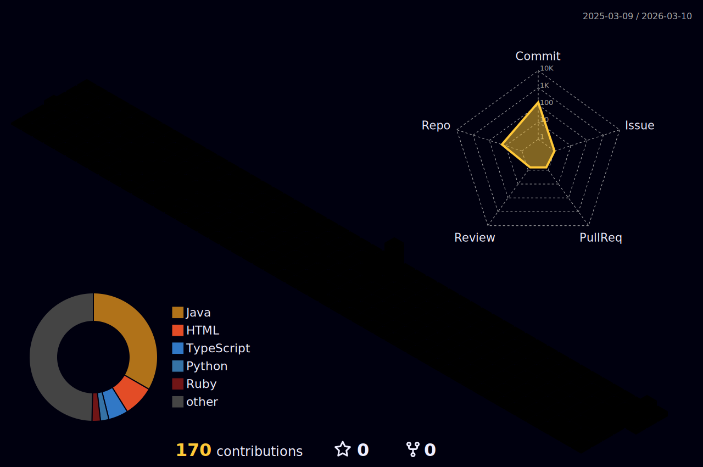

 [)](https://git.io/typing-svg)
 <div>
  
 </div>
 
 ɪ'ᴍ ᴍᴀʀᴄᴇʟᴏ ᴄᴀʀɴᴇɪʀᴏ! 
*Desenvolvedor Web & Mobile | Estudante de ADS | Estagiário na SEFIN*  
<br /> 
<table align="right">
  <tr><td><a href="README.md"> English</a></td></tr>
</table>            
<p align="left">Sou desenvolvedor web e mobile, com paixão por automação, criação de aplicações interativas e exploração de novas tecnologias. Tenho experiência com Ruby on Rails, JavaScript, HTML, CSS, Bootstrap, e gosto de desenvolver projetos que tornam processos mais fáceis e dinâmicos.</p>

- ✨ Aprendiz para toda a vida  
- 🌱 Atualmente explorando desenvolvimento web avançado e automação  
- 💁‍♂️ Estagiário na [SEFIN - Secretaria de Finanças, Fortaleza](https://www.fortaleza.ce.gov.br/sefin)  
- 🏙 Apaixonado por criar jogos e aplicações interativas   
- ❤ Contribuindo para projetos pessoais e open-source  
- 💻 Confira meu [GitHub](https://github.com/Marcelo-C-Silva) para mais detalhes

</div>


```txt
                                       HTML  ███████████░░░░░░░░░ まあまあ Not Bad
                                        CSS  █████████████░░░░░░░ そこそこ Alright
                                 JavaScript  ████████████░░░░░░░░ まあまあ Not Bad
                                     Muscle  ██░░░░░░░░░░░░░░░░░░ よわよわ Weak   
````
  <a href="https://github.com/Marcelo-C-Silva">
     
  </a>


<div align="center">

  <div style="display: flex; justify-content: center; gap: 20px; margin-bottom: 10px;">
    
    
    
    
    
  </div>

  <div style="display: flex; justify-content: center; gap: 20px; margin-bottom: 10px;">
    
    
    
    
    
  </div>

  <div style="display: flex; justify-content: center; gap: 20px;">
    
    
  </div>

</div>


<div align="center">  
  <br><br>
  <a href="mailto:jmarcelocarneiro@edu.unifor.br">
    
  </a>
  <a href="https://www.linkedin.com/in/jo%C3%A3o-marcelo-009873234/" target="_blank">
    
  </a>
</div>
 
